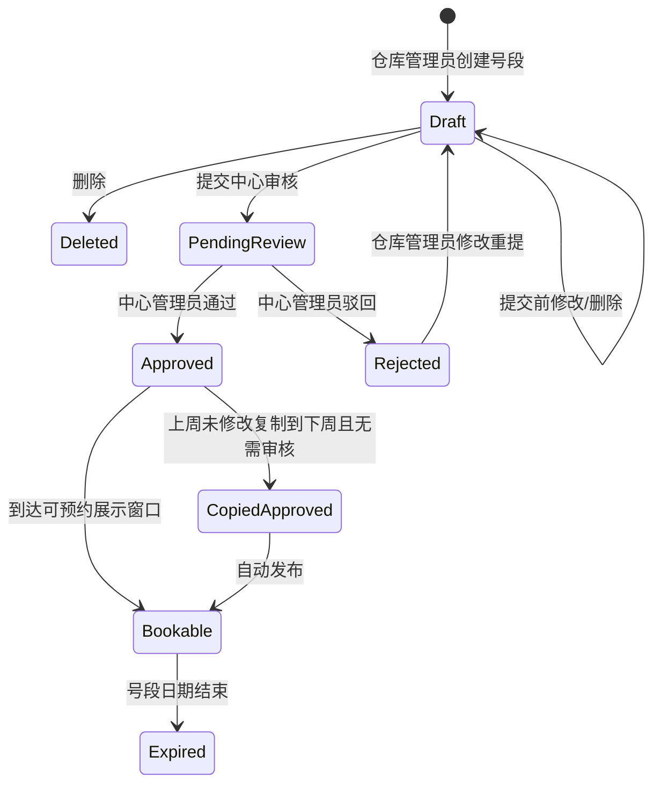
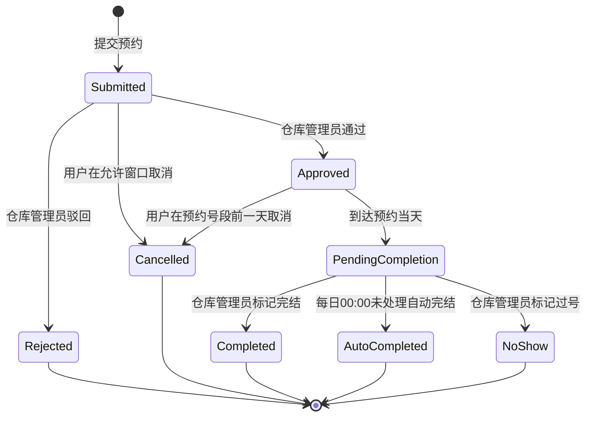
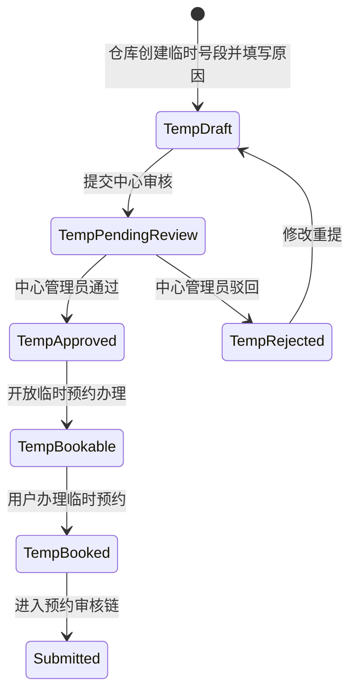
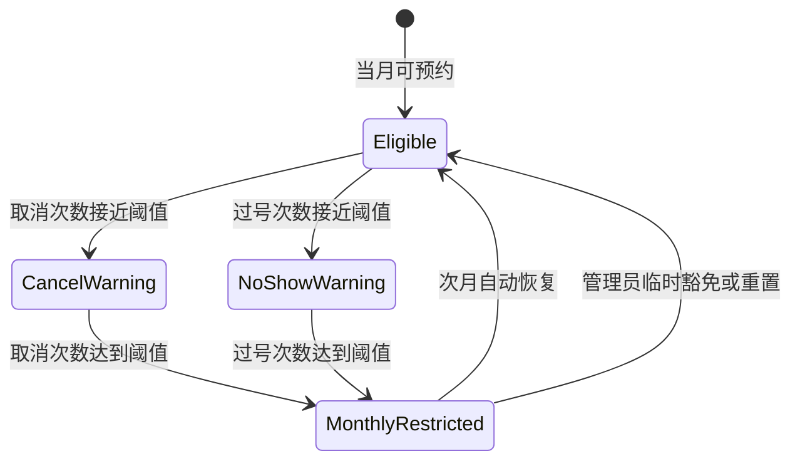

# 预约管理实施计划

## 0. 基线口径

本文档用于把 `预约管理需求-汇总材料 - 260721.xlsx` 的 `需求` TAB 整理为可执行的研发基线。`预约/` 原型只作为页面拆分和交互参考，不作为功能规则的优先来源。后续页面清单、组件清单、状态机、接口和验收用例均按下面口径处理。

1. 需求优先级：`需求` TAB 已写明的，以 `需求` TAB 为准。
2. 终端模型：不再把 i国网、e链国网作为页面维度。当前只分为：
   - 用户前端：预约入口，需同时适配 PC 端和移动端。
   - 管理端：物资智慧管理平台 PC 端，承载创建、配置、审核、完结、过号、统计等管理动作。
3. 预约类型：以 `需求` TAB 为准，包含供应商到货、调配出库、调配入库、施工领料。系统管理员可新增、删除、启用、禁用。
4. 发起方角色：支持施工队、供应商、承运商以及仓库管理员提交预约信息。`承运商` 先作为单位/账号类型处理，不擅自新增“承运商预约类型”。
5. 审核链路：放号审核由中心管理员处理；预约审核由仓库管理员处理。两条审批链分开。
6. 禁约名单：MVP 不单独实现“禁约名单管理”页面。取消或过号次数达到阈值后，通过资格校验禁止当月预约；如后续需要独立名单，推荐按账号维度落地，并关联单位用于统计。
7. 临时预约：以需求为准，仓库临时创建号段并注明原因，中心站管理员审核通过后，用户可办理临时预约。原型中“用户因迟到发起临时预约”的表达作为后续增强或场景补充，不作为 MVP 主流程。

## 1. 页面清单

### 1.1 用户前端（PC + 移动端）

用户前端面向施工队、供应商、承运商等外部/业务用户，要求同一业务能力同时支持 PC 和移动端适配。实现上可以共用接口和业务组件，按响应式布局或双端壳层适配。

| 页面编号 | 页面 | 端 | 用户 | 核心功能 | 原型参考 | MVP 结论 |
|---|---|---|---|---|---|---|
| U01 | 可预约号段列表 / 预约首页 | PC + 移动 | 施工队、供应商、承运商 | 按仓库、日期、预约类型查看可预约号段；只能本周预约下周号段；展示剩余容量和禁约提示 | `预约/08_appt_booking.html` | 必做 |
| U02 | 新建预约 | PC + 移动 | 施工队、供应商、承运商 | 选择预约类型、仓库、作业面、号段；填写所属公司全称、联系人、联系方式；提交预约 | `预约/08_appt_booking.html` | 必做 |
| U03 | 我的预约列表 | PC + 移动 | 预约发起人 | 查看本人/本单位预约记录、审核状态、完结状态、取消状态 | `预约/08_appt_booking.html`、`预约/08a_booking_detail.html` | 必做 |
| U04 | 预约详情 | PC + 移动 | 预约发起人 | 查看预约编号、类型、仓库、作业面、号段、审核结果、操作历史 | `预约/08a_booking_detail.html` | 必做 |
| U05 | 取消预约确认 | PC + 移动 | 预约发起人 | 在预约号段前一天取消；展示取消规则、剩余取消次数、取消后果；提交取消原因 | `预约/08c_cancel_confirm.html` | 必做 |
| U06 | 预约调整 | PC + 移动 | 预约发起人 | 对未到预约日期且允许调整的预约重新选择号段；记录调整历史 | `预约/08b_booking_adjust.html` | 建议做，若排期紧可后置 |
| U07 | 临时预约办理 | PC + 移动 | 施工队、供应商、承运商 | 查看已审核通过的临时号段并办理临时预约 | `预约/10_appt_temp.html` | MVP 只保留办理入口，不实现用户主动申请临时号段 |
| U08 | 禁约/资格提示页 | PC + 移动 | 预约发起人 | 当取消或过号达到阈值时阻止提交，并说明本月禁约原因、恢复时间 | `预约/14_appt_cancel_config.html` 的规则参考 | 不单独做列表页，作为提交前校验和提示组件 |

### 1.2 管理端（物资智慧管理平台 PC）

管理端只考虑 PC 端。角色包括系统管理员、中心管理员、仓库管理员。页面可按现有 `预约/` 原型继续拆分。

| 页面编号 | 页面 | 角色 | 核心功能 | 原型参考 | MVP 结论 |
|---|---|---|---|---|---|
| M01 | 中心站管理列表 | 系统管理员 | 导入中心站和管辖仓库；查询中心站；查看状态 | `预约/05_appt_station.html` | 必做 |
| M02 | 中心站仓库管理 | 系统管理员 | 维护中心站管辖仓库；绑定/解绑仓库；查看仓库状态 | `预约/05a_station_warehouse.html` | 必做 |
| M03 | 中心站管理员绑定 | 系统管理员 | 为中心站绑定中心管理员，用于后续号段审核 | `预约/05b_station_admin_bind.html` | 必做 |
| M04 | 中心站详情 | 系统管理员、中心管理员 | 查看中心站、管理员、管辖仓库信息 | `预约/05c_station_detail.html` | 必做 |
| M05 | 作业面管理列表 | 仓库管理员 | 管理本仓库作业面；查询、启用、停用 | `预约/06_appt_area.html` | 必做 |
| M06 | 作业面最大个数设置 | 仓库管理员 | 设置仓库作业面上限，防止超过承载能力 | `预约/06a_area_max_config.html` | 必做 |
| M07 | 作业面新增/编辑 | 仓库管理员 | 新增或编辑作业面名称、描述、状态 | `预约/06b_area_form.html` | 必做 |
| M08 | 作业面详情 | 仓库管理员 | 查看作业面基础信息、关联号段、使用情况 | `预约/06c_area_detail.html` | 必做 |
| M09 | 预约类型管理 | 系统管理员 | 维护供应商到货、调配出库、调配入库、施工领料；新增、删除、启用、禁用 | `预约/12_appt_type.html` | 必做 |
| M10 | 放号管理列表 | 仓库管理员 | 按周维护本仓库号段；查看审核状态；提交审核 | `预约/07_appt_slot.html` | 必做 |
| M11 | 新增/编辑号段 | 仓库管理员 | 按一小时号段维护日期、时间、作业面、预约类型、容量数量；提交前可改可删 | `预约/07a_slot_form.html` | 必做，需要补齐数量/混合模式字段 |
| M12 | 号段详情 | 仓库管理员、中心管理员 | 查看号段基础信息、容量、预约记录、审核历史 | `预约/07b_slot_detail.html` | 必做 |
| M13 | 默认号段配置/复制下周 | 仓库管理员 | 保存默认号段；若本周未修改则复制到下周且无需审核 | 原型未完整覆盖 | 必做，建议并入放号管理 |
| M14 | 放号截止时间配置 | 系统管理员或中心管理员 | 配置放号截止时间，如每周五 16:00 | 原型未覆盖 | 必做，建议并入放号管理或系统配置 |
| M15 | 号段审核卡片列表 | 中心管理员 | 按仓库、日期分组展示待审核号段；支持单个/批量通过、驳回 | `预约/13_appt_slot_review.html` | 必做，需由表格改为卡片/分组表达 |
| M16 | 号段驳回原因 | 中心管理员 | 号段驳回时填写原因，通知仓库管理员 | `预约/13_appt_slot_review.html` | 必做，可用弹窗 |
| M17 | 预约审核列表 | 仓库管理员 | 查看供应商、承运商、施工队、仓库管理员提交的预约；按状态筛选 | `预约/09_appt_review.html` | 必做 |
| M18 | 预约审核详情 | 仓库管理员 | 查看单位、联系人、联系方式、预约类型、仓库、作业面、号段；通过/驳回 | `预约/09a_review_detail.html` | 必做 |
| M19 | 预约驳回原因 | 仓库管理员 | 填写驳回原因并通知预约联系人 | `预约/09b_reject_reason.html` | 必做，可用弹窗 |
| M20 | 完结/过号处理 | 仓库管理员 | 对当天预约标记完结或过号；过号后通知联系人并累计次数 | `预约/09c_complete_confirm.html` | 必做，术语需统一为“过号” |
| M21 | 临时号段管理 | 仓库管理员 | 创建临时号段、填写原因、提交中心管理员审核 | `预约/10_appt_temp.html`、`预约/10a_temp_supplement.html` | 必做，需按需求改为仓库发起 |
| M22 | 临时号段审核 | 中心管理员 | 审核仓库提交的临时号段，通过后开放临时预约办理 | 可复用 `预约/13_appt_slot_review.html` | 必做 |
| M23 | 取消预约管理 | 系统管理员、仓库管理员 | 配置取消阈值、取消窗口期；查看单位取消次数；临时豁免/重置 | `预约/14_appt_cancel_config.html` | 必做，独立禁约名单暂不做 |
| M24 | 过号阈值配置 | 系统管理员、仓库管理员 | 配置过号次数阈值；查看单位/账号过号次数 | `预约/14_appt_cancel_config.html`、`预约/11a_unit_stats_detail.html` | 必做，可并入取消预约管理 |
| M25 | 统计概览 | 中心管理员、仓库管理员、系统管理员 | 按施工队、供应商、承运商、仓库统计月度/年度取消、过号、临时预约 | `预约/11_appt_stats.html` | 必做 |
| M26 | 单位统计详情 | 中心管理员、仓库管理员、系统管理员 | 查看单位预约、取消、过号、临时预约明细和违规记录 | `预约/11a_unit_stats_detail.html` | 必做 |
| M27 | 趋势分析 | 中心管理员、仓库管理员、系统管理员 | 查看月度趋势、取消率、类型占比、仓库对比 | `预约/11b_trend_charts.html` | 建议做，若排期紧可后置 |
| M28 | 仓库管理员代约 / 内部预约 | 仓库管理员 | 仓库管理员在管理端为内部调配或特殊业务提交预约信息，填写公司全称和联系方式 | `预约/08_appt_booking.html` | 必做，可复用用户端预约表单和接口 |

## 2. 组件清单

### 2.1 通用基础组件

| 组件 | 使用端 | 说明 |
|---|---|---|
| 应用布局 | 用户前端、管理端 | 管理端为 PC 左侧菜单 + 内容区；用户前端 PC 为顶部/侧边导航，移动端为顶部栏 + 底部操作区 |
| 权限路由 | 用户前端、管理端 | 根据系统管理员、中心管理员、仓库管理员、外部用户、仓库管理员预约人身份控制菜单和按钮 |
| 查询筛选栏 | 用户前端、管理端 | 支持中心站、仓库、日期、预约类型、审核状态、完结状态、单位类型、关键词筛选 |
| 数据表格 | 管理端 | 列表、分页、排序、批量选择、批量审核、行内操作 |
| 移动端列表卡片 | 用户前端移动端 | 替代表格，展示预约号段、状态、操作按钮 |
| 状态标签 | 用户前端、管理端 | 展示待提交、审核中、已通过、已驳回、已取消、待完结、已完结、已过号、禁约等状态 |
| 详情信息组 | 用户前端、管理端 | 标签-值形式展示预约、号段、单位、联系人、审核信息 |
| 操作历史时间线 | 用户前端、管理端 | 记录创建、提交、审核、取消、完结、过号、自动处理等操作 |
| 确认弹窗 | 用户前端、管理端 | 用于取消、删除、通过、驳回、完结、过号、重置、豁免等二次确认 |
| 消息提示 | 用户前端、管理端 | 表单成功/失败、规则拦截、消息通知结果 |
| 附件/导入控件 | 管理端 | 中心站、仓库基础信息导入；导入结果校验和错误下载 |

### 2.2 预约业务组件

| 组件 | 使用页面 | 说明 |
|---|---|---|
| 周期选择器 | U01、M10、M15 | 按周查看号段；限制只能本周预约下周、提前一周放号 |
| 号段日历/时间轴 | U01、U02、M10、M12 | 按日期、小时、作业面展示号段和剩余容量 |
| 号段容量编辑器 | M11、M13 | 支持作业类型数量、混合模式总数量和按类型数量配置 |
| 作业面选择器 | U02、M11、M21 | 按仓库加载可用作业面，并受最大作业面配置限制 |
| 预约类型选择器 | U02、M11、M21 | 读取预约类型配置，默认包含四类，可扩展 |
| 单位和联系人表单 | U02、U07、M18、M28 | 填写或展示公司全称、联系人、联系方式、单位类型 |
| 预约资格校验提示 | U01、U02、U05 | 根据取消次数、过号次数、禁约期限、预约窗口判断能否预约或取消 |
| 号段审核卡片 | M15、M22 | 按仓库、日期分组展示号段，支持单个/批量通过和驳回 |
| 预约审核面板 | M17、M18 | 展示预约详情、单位信息、联系人信息，执行通过/驳回 |
| 完结/过号处理面板 | M20 | 对当天已通过预约标记完结或过号，填写过号原因 |
| 临时号段创建表单 | M21 | 仓库管理员填写日期、时间、作业面、预约类型、容量、临时原因 |
| 阈值配置表单 | M23、M24 | 配置取消次数阈值、过号次数阈值、取消窗口期、处理方式 |
| 单位违规监控表 | M23、M24、M26 | 展示单位/账号取消次数、过号次数、阈值状态和处理动作 |
| 统计指标卡 | M25、M26 | 展示预约量、取消次数、过号次数、临时预约次数、取消率等 |
| 趋势图表 | M25、M27 | 月度/年度趋势、类型占比、仓库对比、单位排行 |

## 3. 状态机

### 3.1 号段状态机

号段由仓库管理员创建，中心管理员审核。只有审核通过的普通号段和临时号段可以被用户预约。

关键规则：

1. `Draft` 状态允许修改和删除；提交审核后不允许仓库管理员直接修改。
2. 放号只允许提前一周。截止时间可配置，默认建议每周五 16:00。
3. 上周号段未修改、仅复制到下一周时，无需再次审核，但必须保留来源记录。
4. 号段容量必须记录总数量、已预约数量、剩余数量。混合模式下还要记录各预约类型占用情况。

### 3.2 预约状态机

预约由用户前端或仓库管理员提交，仓库管理员审核。当天由仓库管理员完结或过号；若到每日 00:00 未处理，系统自动按工单完结处理。

关键规则：

1. 预约提交前必须校验用户当月取消次数、过号次数和预约窗口。
2. 预约信息必须包含公司全称、联系人和联系方式。
3. 仓库管理员审核时必须能看到单位、联系人、联系方式。
4. 取消操作必须记录到用户/单位操作记录，用于后续考核。
5. 过号后通知预约联系人并累计过号次数；达到阈值后禁止当月预约。

### 3.3 临时号段状态机

MVP 采用需求口径：临时号段由仓库创建，中心审核，通过后用户办理临时预约。

关键规则：

1. 临时号段必须标记 `slotKind=temporary`，并记录临时原因。
2. 临时号段通过后才能被用户预约。
3. 临时预约次数需要进入统计口径。

### 3.4 当月禁约状态机

MVP 不维护独立禁约名单，使用取消/过号阈值动态判断预约资格。

关键规则：

1. 禁约维度建议按账号判断，单位维度用于统计和管理展示。
2. 次月自动恢复预约资格。
3. 管理端可预留重置次数和临时豁免操作，但需要权限控制和操作日志。

## 4. 接口依赖

下面接口为实施依赖清单，不限定最终 REST 路径。研发时可根据现有平台网关、权限系统、接口规范调整命名。

### 4.1 基础与权限

| 依赖域 | 接口能力 | 主要字段 | 调用方 |
|---|---|---|---|
| 登录用户/权限 | 获取当前用户、角色、管辖范围 | userId、role、orgId、warehouseIds、stationIds、unitType | 全端 |
| 数据字典 | 获取预约类型、单位类型、审核状态、完结状态、取消原因、过号原因 | dictCode、label、value、enabled | 全端 |
| 组织/单位 | 查询施工队、供应商、承运商、仓库单位 | unitId、unitName、unitType、contact、phone | 用户前端、管理端 |
| 消息通知 | 发送站内信/短信/系统消息 | receiverId、phone、templateCode、businessId、content | 管理端、定时任务 |
| 操作日志 | 记录审核、取消、完结、过号、重置、豁免 | operatorId、action、before、after、reason、time | 管理端 |

### 4.2 中心站、仓库、作业面

| 资源 | 接口能力 | 说明 |
|---|---|---|
| 中心站 | 导入、列表、详情、编辑、启用/停用 | 支持从基础信息表或平台主数据导入 |
| 中心站仓库关系 | 查询、绑定、解绑 | 中心管理员号段审核权限依赖该关系 |
| 中心管理员绑定 | 绑定、换绑、解绑、查询 | 一个中心站可绑定一个或多个中心管理员，按平台权限口径定 |
| 仓库 | 查询本中心/本仓库列表 | 放号、预约、统计均依赖仓库 |
| 作业面 | 列表、新增、编辑、详情、启用/停用 | 仓库管理员按本仓库维护 |
| 作业面上限 | 查询、保存、校验 | 新增作业面时不允许超过上限 |

### 4.3 预约类型

| 资源 | 接口能力 | 说明 |
|---|---|---|
| 预约类型 | 列表、新增、编辑、删除、启用、禁用 | 初始四类：供应商到货、调配出库、调配入库、施工领料 |
| 类型角色关系 | 查询、保存 | 用于限制不同单位类型可选择的预约类型 |

### 4.4 放号与号段审核

| 资源 | 接口能力 | 说明 |
|---|---|---|
| 号段 | 列表、详情、新增、编辑、删除 | 仓库管理员提交前可改可删 |
| 号段容量 | 保存总容量、按类型容量、已占用、剩余容量 | 支持混合模式 |
| 默认号段模板 | 查询、保存、复制下周 | 未修改复制下周时无需审核 |
| 放号窗口规则 | 查询、保存、校验 | 默认建议每周五 16:00 截止 |
| 号段提交审核 | 提交普通号段或临时号段 | 提交后通知中心管理员 |
| 号段审核 | 待审列表、卡片分组、单个通过、批量通过、驳回 | 按仓库和日期分组 |
| 可预约号段查询 | 按用户资格、仓库、日期、类型返回可预约号段 | 用户前端依赖 |

### 4.5 预约办理与审核

| 资源 | 接口能力 | 说明 |
|---|---|---|
| 预约资格 | 提交前校验、取消前校验 | 校验本周约下周、取消窗口、取消/过号阈值 |
| 预约 | 新增、列表、详情、调整、取消 | 用户前端 PC + 移动端共用；管理端 M28 可复用新增能力 |
| 我的预约 | 按本人/本单位查询 | 需要明确数据权限：账号维度为主，单位维度可用于管理 |
| 预约审核 | 仓库管理员待审列表、详情、通过、驳回 | 审核时展示单位和联系人信息 |
| 完结处理 | 标记完结 | 当天预约由仓库管理员处理 |
| 过号处理 | 标记过号、填写原因、累计次数、通知联系人 | 达阈值后当月禁约 |
| 自动完结任务 | 每日 00:00 扫描未处理预约并按工单完结 | 需要幂等和日志 |

### 4.6 取消、过号、临时预约、统计

| 资源 | 接口能力 | 说明 |
|---|---|---|
| 取消配置 | 查询、保存取消阈值、取消窗口期 | 支持全局或按单位类型配置 |
| 过号配置 | 查询、保存过号阈值 | 可与取消配置同页实现 |
| 违规计数 | 查询单位/账号当月取消、过号次数 | 用于提交前资格校验 |
| 计数重置/豁免 | 重置次数、临时豁免 | MVP 可预留，必须有权限和日志 |
| 临时号段 | 创建、提交审核、审核、查询可办理临时号段 | `slotKind=temporary` |
| 临时预约 | 办理、审核、完结、过号 | 进入普通预约状态机 |
| 统计 | 月/年统计、单位详情、仓库统计、中心站统计、趋势分析 | 指标包含取消、过号、临时预约 |
| 导出 | 列表和统计导出 | 排期未明确，可作为后续增强 |

### 4.7 外部系统依赖

| 依赖 | 当前建议 | 风险 |
|---|---|---|
| 用户账号与组织体系 | 复用现有平台账号、单位、角色和权限，不在预约模块内自建账号体系 | 需要确认外部用户是否都有账号和单位编码 |
| 主数据/基础信息表 | 中心站、仓库、管理员初始数据可导入或同步 | 数据源字段需与 `基础信息表.xlsx` 对齐 |
| 调令、仓储、配送 | 差异化分析提到上游调令、下游仓储/配送联动，MVP 先预留业务单号字段和接口扩展点 | 若业务要求预约必须绑定调令，则会影响 U02 新建预约表单和接口 |
| 消息通道 | 需接入短信、站内信或平台消息能力 | 消息模板和触达方式需由平台统一 |

## 5. 验收用例

| 用例编号 | 场景 | 前置条件 | 操作 | 预期结果 |
|---|---|---|---|---|
| AC-01 | 导入中心站和仓库 | 系统管理员登录管理端 | 上传符合模板的中心站/仓库数据 | 成功生成中心站、仓库及管辖关系；错误数据给出行级提示 |
| AC-02 | 绑定中心管理员 | 已有中心站和管理员账号 | 为中心站绑定中心管理员 | 绑定后该管理员可查看并审核管辖仓库号段 |
| AC-03 | 数据权限隔离 | 系统管理员、中心管理员、仓库管理员分别登录 | 查看中心站、仓库、号段、预约列表 | 系统管理员看全量；中心管理员看管辖中心/仓库；仓库管理员只看本仓库 |
| AC-04 | 维护预约类型 | 系统管理员登录 | 新增、启用、禁用、删除预约类型 | 四类默认类型存在；禁用后用户不可再选择；已有预约历史不丢失 |
| AC-05 | 作业面上限校验 | 仓库已设置最大作业面数 | 尝试新增超过上限的作业面 | 系统阻止保存并提示超过上限 |
| AC-06 | 创建普通号段 | 仓库管理员登录 | 新增下周一小时号段，选择作业面、预约类型、容量 | 号段保存为待提交；容量字段完整；提交前可修改和删除 |
| AC-07 | 混合模式容量 | 仓库管理员创建号段 | 设置总容量和按预约类型占用规则 | 用户预约时按容量扣减，超过容量不可提交 |
| AC-08 | 放号截止时间 | 当前时间超过配置截止时间 | 仓库管理员尝试创建或提交下周号段 | 系统按规则阻止或提示已过截止时间 |
| AC-09 | 复制下周号段免审 | 仓库上周号段未修改 | 执行复制到下一周 | 自动生成下周已通过号段，保留复制来源，无需中心审核 |
| AC-10 | 提交号段审核 | 仓库管理员有待提交号段 | 点击提交审核 | 号段进入待审核；仓库管理员不可直接修改；中心管理员收到消息 |
| AC-11 | 号段审核分组 | 中心管理员登录 | 打开号段审核页 | 待审号段按仓库、日期卡片分组展示，支持单个和批量通过 |
| AC-12 | 号段驳回 | 中心管理员驳回号段并填写原因 | 仓库管理员查看放号管理 | 号段状态为已驳回；可查看原因并修改重提；收到驳回消息 |
| AC-13 | 用户查看可预约号段 | 用户本月未被禁约 | 在 PC 和移动端进入预约首页 | 只能看到通过审核且允许本周约下周的号段；PC 和移动端信息一致 |
| AC-14 | 提交预约必填校验 | 用户选择可预约号段 | 不填写公司全称、联系人或联系方式直接提交 | 系统阻止提交并提示必填项 |
| AC-15 | 提交预约成功 | 用户填写完整预约信息 | 提交预约 | 生成预约记录，进入待审核；通知用户提交成功或预约成功口径按产品确认 |
| AC-16 | 仓库审核预约 | 仓库管理员登录 | 查看预约详情并通过预约 | 可看到单位、联系人、联系方式；通过后用户收到通知 |
| AC-17 | 预约驳回 | 仓库管理员填写驳回原因 | 用户查看预约详情 | 状态为已驳回；展示驳回原因和操作历史 |
| AC-18 | 用户取消预约 | 当前时间满足预约号段前一天取消规则 | 用户取消已提交或已通过预约 | 状态变为已取消；释放号段容量；取消次数累计；操作历史完整 |
| AC-19 | 取消窗口限制 | 当前时间不满足取消规则 | 用户尝试取消预约 | 系统阻止取消并展示规则说明 |
| AC-20 | 取消阈值禁约 | 用户当月取消次数达到阈值 | 用户尝试新增预约 | 系统阻止预约并提示当月禁止预约、原因和恢复时间 |
| AC-21 | 完结处理 | 已通过预约到达当天 | 仓库管理员标记完结 | 预约状态为已完结，操作历史记录处理人和时间 |
| AC-22 | 过号处理 | 已通过预约到达当天且用户未履约 | 仓库管理员标记过号并填写原因 | 预约状态为已过号；联系人收到消息；过号次数累计 |
| AC-23 | 过号阈值禁约 | 用户当月过号次数达到阈值 | 用户尝试新增预约 | 系统阻止预约并提示当月禁止预约 |
| AC-24 | 自动完结任务 | 当天存在未处理的待完结预约 | 每日 00:00 后查看预约 | 系统按工单完结处理，记录自动任务日志，重复执行不重复处理 |
| AC-25 | 临时号段创建和审核 | 仓库有临时预约需求 | 仓库管理员创建临时号段并提交，中心管理员审核通过 | 临时号段通过后可被用户办理临时预约，并进入统计 |
| AC-26 | 临时号段驳回 | 中心管理员驳回临时号段 | 仓库管理员查看临时号段 | 状态为已驳回，可查看原因并修改重提 |
| AC-27 | 统计月度/年度指标 | 存在预约、取消、过号、临时预约数据 | 查看统计概览和单位详情 | 可按施工队、供应商、承运商、仓库查看月度/年度取消、过号、临时预约指标 |
| AC-28 | 用户端响应式适配 | 使用 PC 宽屏和移动端宽度访问用户前端 | 查看 U01-U07 页面并完成预约主流程 | 移动端无表格溢出，关键按钮可触达，PC 和移动端业务结果一致 |
| AC-29 | 消息通知 | 发生提交审核、驳回、通过、预约成功、过号等事件 | 查看消息记录或通知通道 | 对应接收人收到正确模板消息，业务编号可追溯 |
| AC-30 | 审计日志 | 发生审核、取消、完结、过号、重置、豁免等管理动作 | 查询操作历史或后台日志 | 记录操作者、时间、动作、原因、前后状态和业务编号 |
| AC-31 | 仓库管理员代约 | 仓库管理员登录管理端 | 在管理端为内部调配或特殊业务提交预约信息 | 预约记录来源标记为管理端代约；仍进入仓库预约审核、完结、过号和统计口径 |

## 6. 执行顺序建议

1. 第一阶段：基础配置和权限。完成中心站、仓库、管理员绑定、作业面、预约类型、阈值配置。
2. 第二阶段：放号闭环。完成普通号段创建、容量、提交、中心审核、可预约号段查询、复制下周、截止时间规则。
3. 第三阶段：预约闭环。完成用户端 PC + 移动端预约、我的预约、详情、取消、仓库预约审核。
4. 第四阶段：履约和管控。完成完结、过号、自动完结、取消/过号阈值禁约、消息通知。
5. 第五阶段：临时预约和统计。完成临时号段、临时预约办理、月度/年度统计、单位详情和趋势分析。

## 7. 当前仍需产品确认的点

这些点不阻塞 MVP 拆解，但会影响细节实现。

| 问题 | 当前建议 |
|---|---|
| 承运商与四类预约类型如何映射 | 承运商作为单位/账号类型；预约类型仍使用系统配置的四类 |
| “预约成功”通知发生在提交后还是审核通过后 | 建议提交后通知“提交成功”，审核通过后通知“预约审核通过” |
| “前一天取消”的截止时间 | 建议按自然日判断：预约日期前一日 23:59:59 前允许取消；如要更严格可配置 |
| 过号与原型“未完结/迟到”术语 | 统一为“过号”，原型中的迟到/未完结归并为过号处理或待完结状态 |
| 临时预约是否允许用户主动申请 | MVP 不做；按需求由仓库创建临时号段，中心审核后用户办理 |
| 是否必须绑定调令/仓储/配送单据 | MVP 预留业务单号字段；若预约必须绑定调令，则需要补充 U02 表单和接口 |
